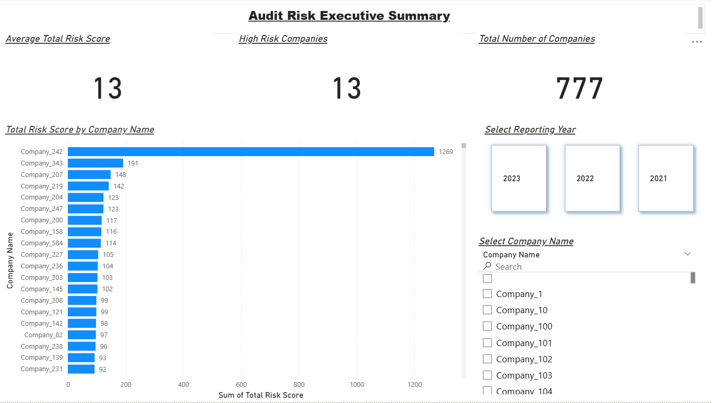
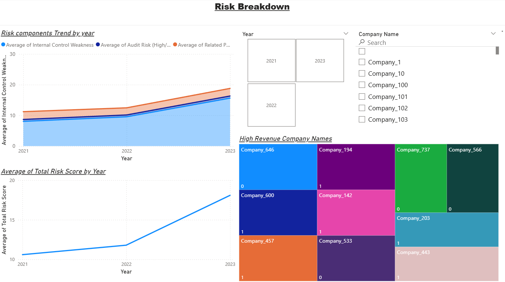

# 🧾 Audit Risk Executive Dashboard (Power BI)

This Power BI dashboard is a professional project designed to help auditors, analysts, and risk professionals **identify, monitor, and analyze audit risk indicators** across companies over multiple years.

The dashboard focuses on **Total Risk Score**, incorporating:
- Internal Control Weakness
- Audit Risk (High/Low)
- Related Party Transactions

It is built to align with **audit analytics and data assurance principles** and is fully interactive for dynamic filtering by company and year.

---

## 📊 Dashboard Overview

### 1️⃣ Executive Summary Page

- **KPIs Displayed:**
  - **Average Total Risk Score**: Summary of risk across all companies.
  - **High Risk Companies Count**: Number of companies with Total Risk Score above threshold.
  - **Total Number of Companies**: Dataset size over 3 years.

- **Visualizations:**
  - **Bar Chart** showing Total Risk Score by Company.
  - **Year and Company Filter Slicers** for interactive analysis.

---

### 2️⃣ Risk Breakdown Page

- **Line Chart**: Trends in
  - Internal Control Weakness (ICW)
  - Audit Risk
  - Related Party Transactions

- **Total Risk Score Over Time**: Shows increasing risk score trend across 2021–2023.

- **Treemap**: Highlights companies with high revenue associated with higher audit risk factors.

---

## 📁 Files Included

- `A Multi-Year Analysis of Key Risk Factors Across Companies.pbix` – Power BI file.
- `Page 01 Executive Summary.png` – Executive Summary screenshot.
- `Page 02 Risk Breakdown.png` – Risk Breakdown screenshot.
- `enhanced_audit_dataset.csv` – Dummy data used for visualization.

---

## 🎯 Key Insights & Findings

- **Rising Risk Trend**: Internal Control Weakness and Total Risk Scores have shown a consistent upward trend from 2021 to 2023.
- **Outliers Detected**: A small number of companies (e.g., `Company_242`) exhibit disproportionately high risk scores, indicating a need for targeted audit focus.
- **High Revenue vs High Risk**: Treemap visual shows high-revenue companies are also associated with higher audit risk metrics, suggesting a potential link between scale and risk exposure.
- **Control Breakdown Emphasis**: Dashboard avoids traditional audit terms like “control risk” or “inherent risk” in favor of practical terms like “internal control weakness” and “related party transaction,” improving clarity for non-technical users.

---

## ✅ Conclusion

This Power BI dashboard serves as a powerful audit analytics tool that:
- **Simplifies complex audit metrics**
- **Visually identifies risk-heavy entities**
- **Empowers auditors to filter by year/company**
- **Supports data-driven audit planning and risk mitigation**

It is especially useful for internal auditors, digital assurance teams, and risk consultants looking to embed **data analytics in audit workflows** without relying on complex DAX formulas.

---

## 🛠 Tools Used

- **Power BI Desktop**
- **Microsoft Excel (Data Prep)**
- **GitHub for documentation**

---

## 📌 How to Use

1. Download the `.pbix` file.
2. Open in Power BI Desktop.
3. Use slicers to filter by year or company name.
4. Explore KPIs and risk trends interactively.

---

## 📜 License

This project is for educational and demonstration purposes only.

---

